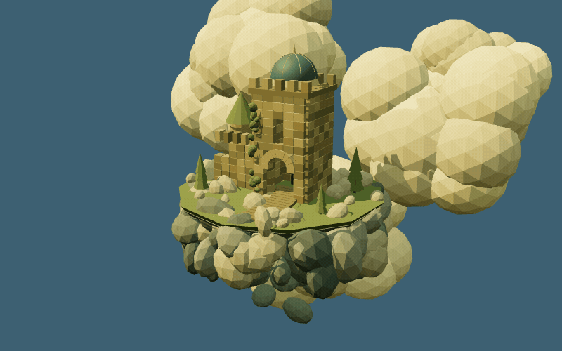

  

  <a href="https://notsaltylol.github.io/notsaltylol/"><b>Explore the island in six styles ↗</b></a> 
  <a href="https://notsaltylol.github.io/notsaltylol/assets/animation.html?style=original">1 · Golden ruins</a> · <a href="https://notsaltylol.github.io/notsaltylol/assets/animation.html?style=pastel">2 · Pastel</a> · <a href="https://notsaltylol.github.io/notsaltylol/assets/animation.html?style=pixel">3 · Pixel</a> · <a href="https://notsaltylol.github.io/notsaltylol/assets/animation.html?style=fantasy">4 · Fantasy</a> · <a href="https://notsaltylol.github.io/notsaltylol/assets/animation.html?style=ink">5 · Clear line</a> · <a href="https://notsaltylol.github.io/notsaltylol/assets/animation.html?style=cozy">6 · Cozy</a>

  <a href="https://github.com/notsaltylol?tab=repositories">Projects</a> &nbsp; / &nbsp;
  <a href="https://www.linkedin.com/in/kwanleon/">LinkedIn</a> &nbsp; / &nbsp;
  <a href="https://github.com/notsaltylol?tab=stars">Things I find interesting</a>

### Hey, I'm Leon 👋

Welcome to my corner of GitHub. A little Python, a little Swift, some C++, and plenty of JavaScript in between.

<a href="./assets/castle-illustration.js">Castle source</a> · <a href="./assets/orbital.html">Orbital source</a> · <a href="./docs/threejs.md">Run and render the Three.js scenes</a>

### A few things to explore

| Project | In the repo |
| :--- | :--- |
| [Sheep the Sheep](https://github.com/notsaltylol/Sheep-the-Sheep) | A Swift project with a very good name. |
| [toonAPI](https://github.com/notsaltylol/toonAPI) | A webcomic crawler written in Python. |
| [2048cpp](https://github.com/notsaltylol/2048cpp) | 2048, in C++. |

### By the numbers

  
  

Public GitHub activity · Language breakdown reflects repository code, not proficiency.

---

<samp>stay curious. stay notsalty.</samp>

