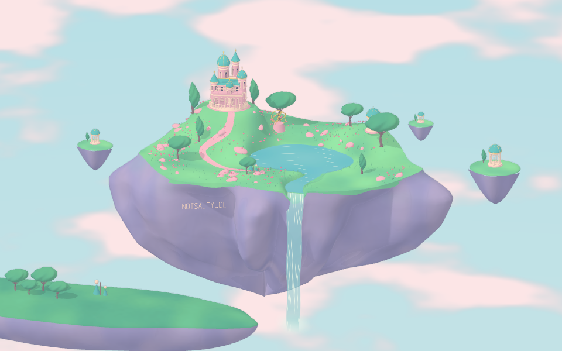
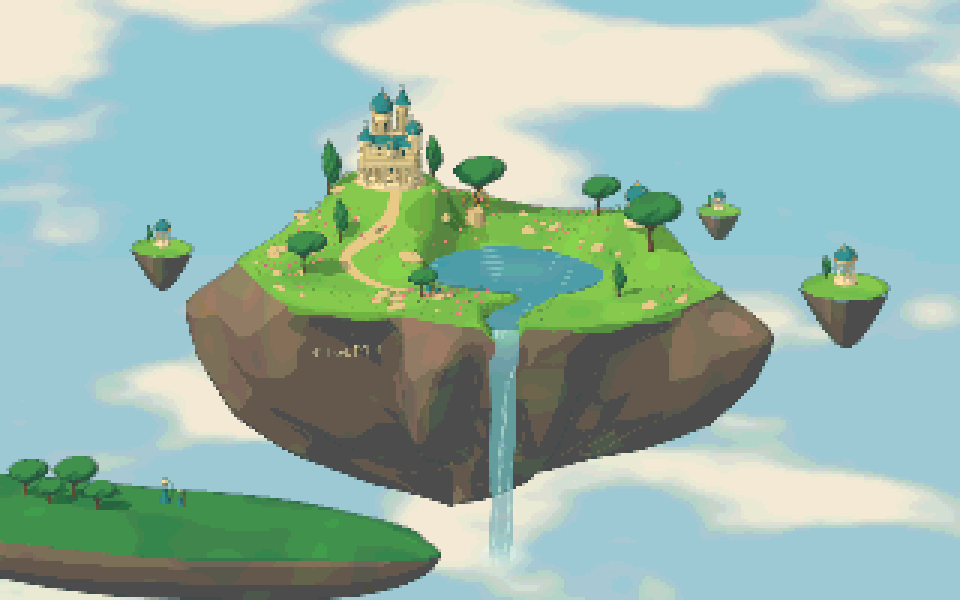

# Six styles in real 3D

Every preview uses the same geometry, camera angle, and lighting direction. The buttons change material and rendering presets. [3D guide](threejs-3d.md) · [Illustrated gallery](style-gallery.md)

## 1. Golden ruins

## 2. Pastel dream

## 3. Pixel garden

## 4. Luminous fantasy

## 5. Clear-line reverie

## 6. Cozy storybook

