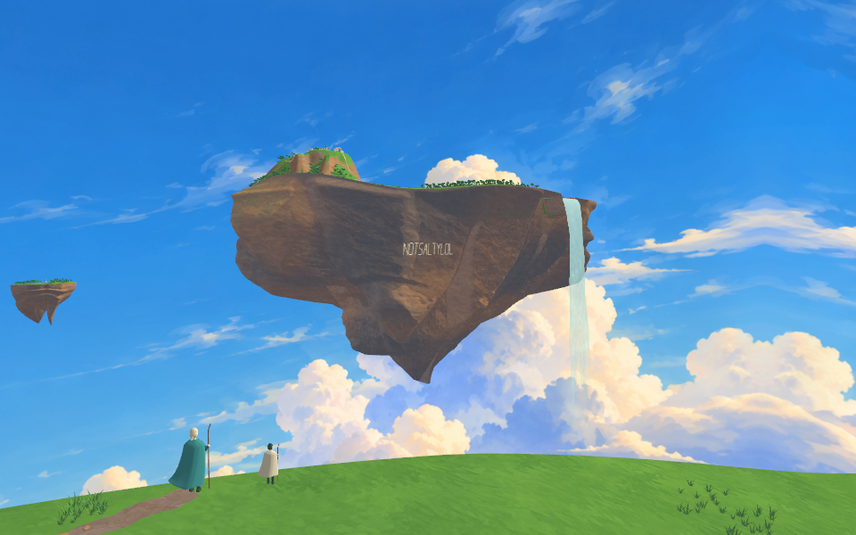
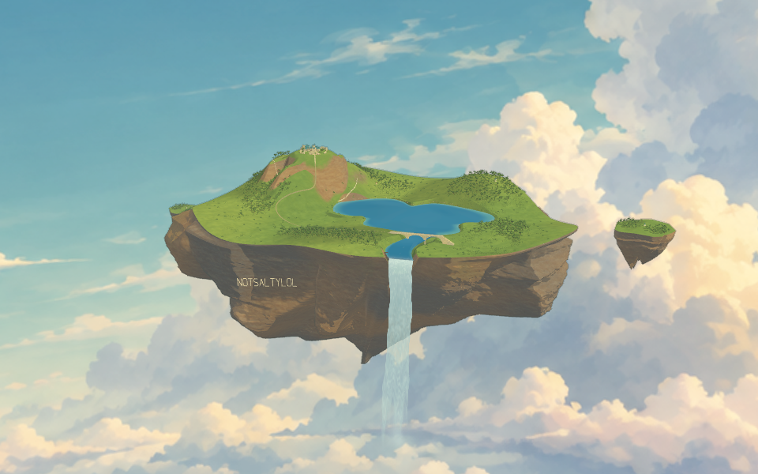
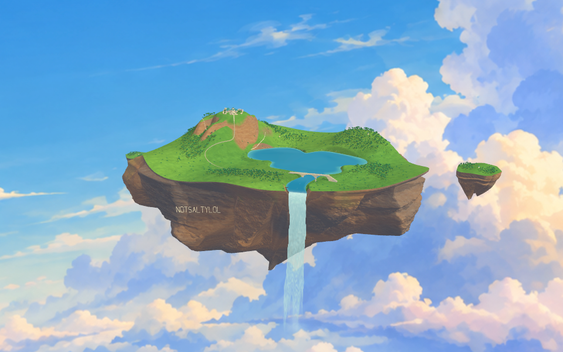
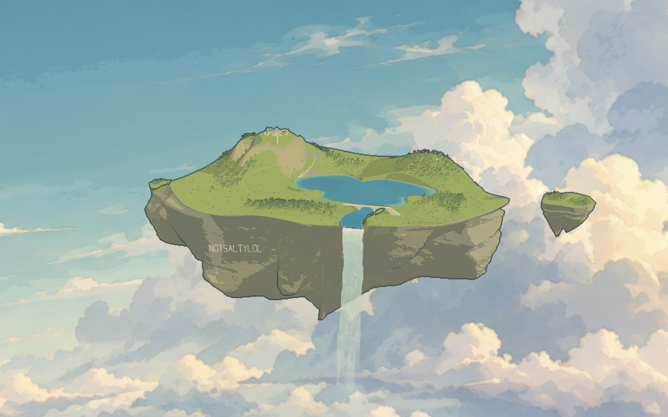
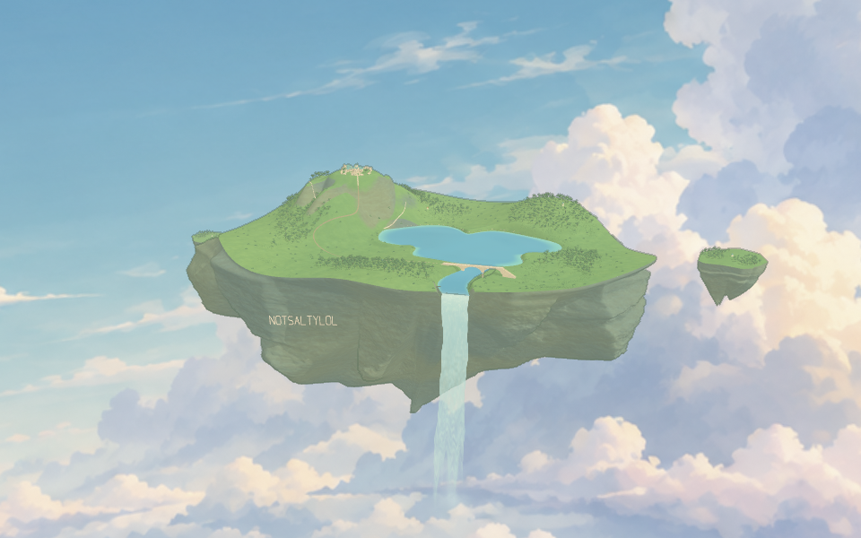
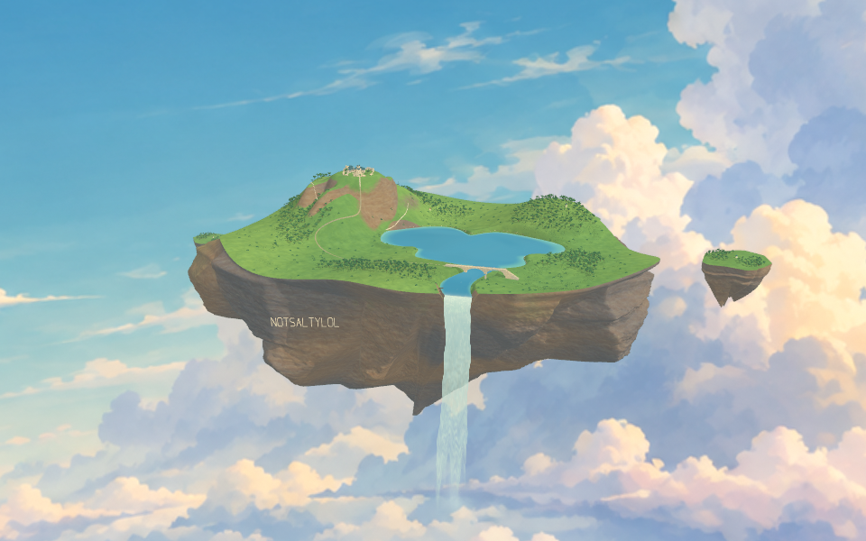

# Five styles in real 3D

The five numbered style previews use the same expanded islands and overview camera angle: 10× the original width, with small buildings and trees across 100× the land area. Use Castle, Lake & bridge, or Lookout in the viewer to inspect the retained fine detail. All five styles share the camera controls, castle masonry, roof tiles, doors, balconies, bridge, shoreline gardens, ivy, foreground path, individual tree leaves, meadow plants, and weathered rock texture. The buttons change palette, material shaders, lighting, outlines, and grain while keeping the current view. [3D guide](threejs-3d.md) · [Illustrated gallery](style-gallery.md)

The scene uses a perspective camera, painted sky, side sunlight, and slow art-directed cloud shadows projected in world space. Wider sky framing places cloud banks beside the island and keeps an open patch around its summit. A [shared habitat layout](../assets/sky-castle-habitat.js) connects woodland stands, meadow drifts, and open routes across trees, grass, ferns, flowers, and stones. Populations and physical sizes are retained, including the lookout's 3,000 shrubs and 9,000 flowers; fine geometry stays available when zoomed in.

The summit now has unequal rock shoulders and a drainage hollow. Grass blends into exposed stone on the same mesh, and plants avoid the bare faces. Below it, unequal oblique cliff wedges meet a broader supporting mass, with local buttresses, clefts, recessed beds and a thin turf edge. Cozy retains cream lights with more readable sage and cool shadow values. The castle road meets its paving using the [actual ground sampler](../assets/sky-castle-ground.js). A [joined ballistic waterfall](../assets/sky-castle-waterfall.js) rolls over the river lip, then breaks into an uneven falling veil and three-dimensional spray. An animated water-coverage pass softens the cliff outlines beneath its foam. The [sky asset](sky-environment.md) and [surface textures](painted-materials.md), including their generation prompts, are published alongside the Three.js source.

## Lookout

Select **Lookout** in the viewer for the foreground composition. The camera stands near the travelers, whose physical size is unchanged, with the distant summit visible and open air beneath the island. The same view is available in all five styles.

## 1. Golden ruins

## 2. Luminous fantasy

## 3. Clear-line reverie

## 4. Cozy storybook

## 5. Ghibli-inspired

Warm sunlight, natural greens, soft painted shadows, and cream clouds on the shared 3D geometry.

