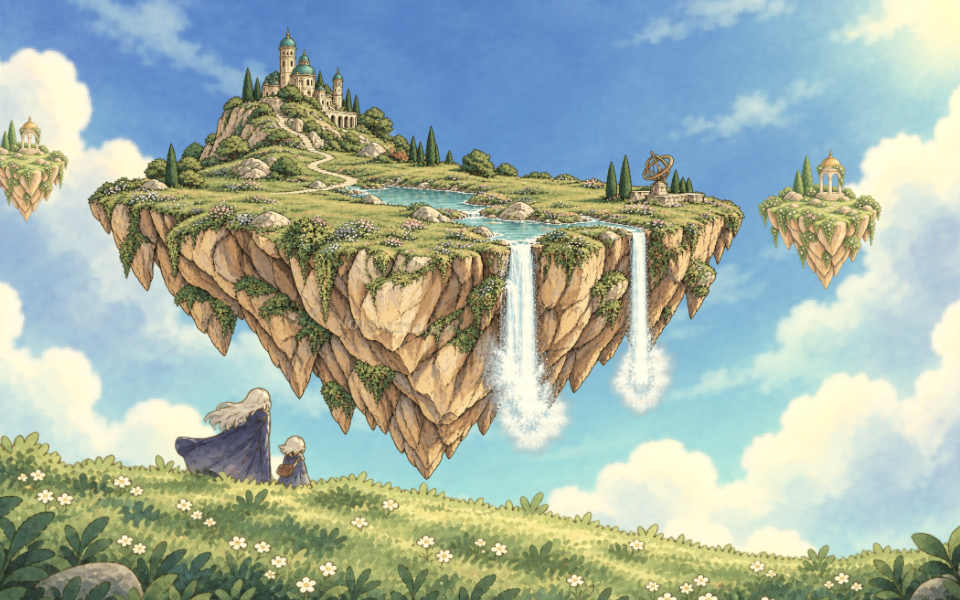
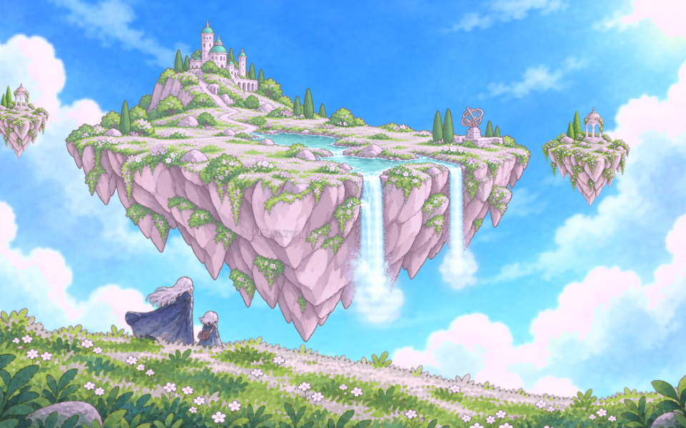
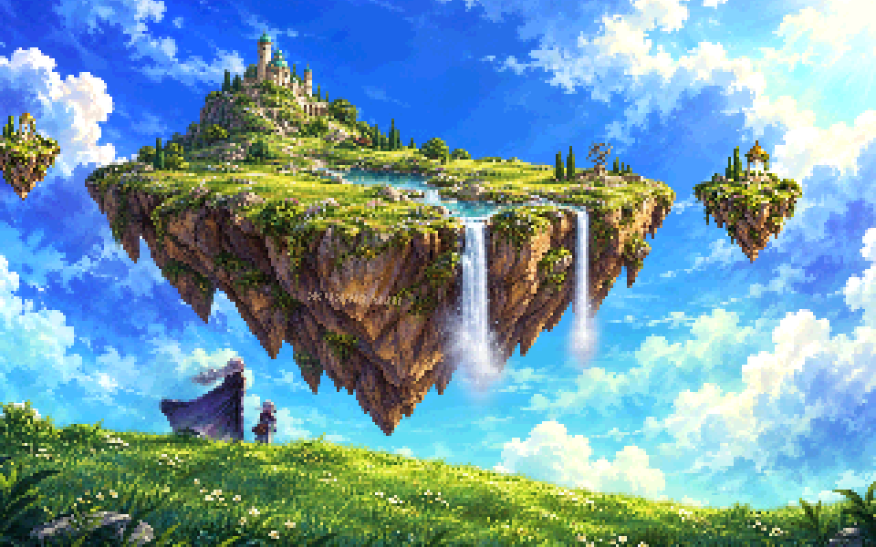
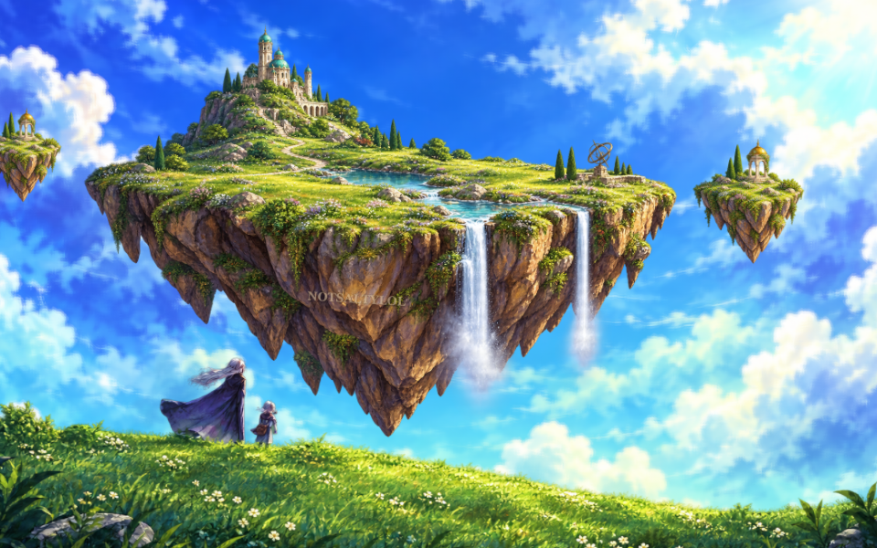
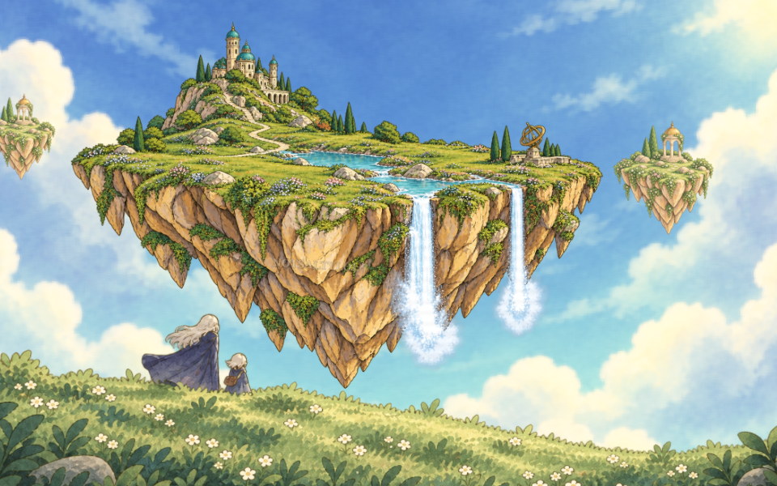
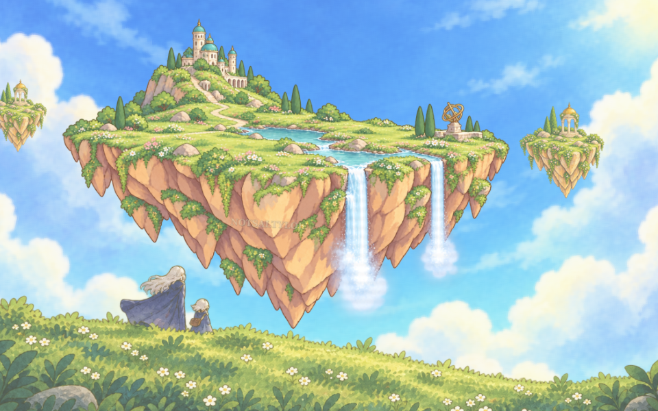

# Six views of the same island

Each image uses the same camera phase and composition. Click a preview to open its interactive theme.

## 1. Golden ruins

## 2. Pastel dream

## 3. Pixel garden

## 4. Luminous fantasy

## 5. Clear-line reverie

## 6. Cozy storybook

